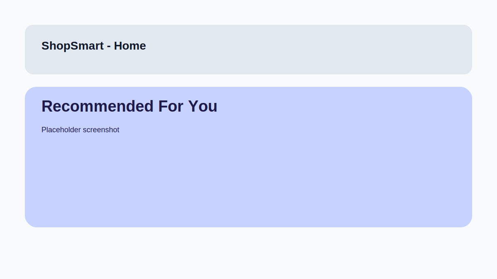
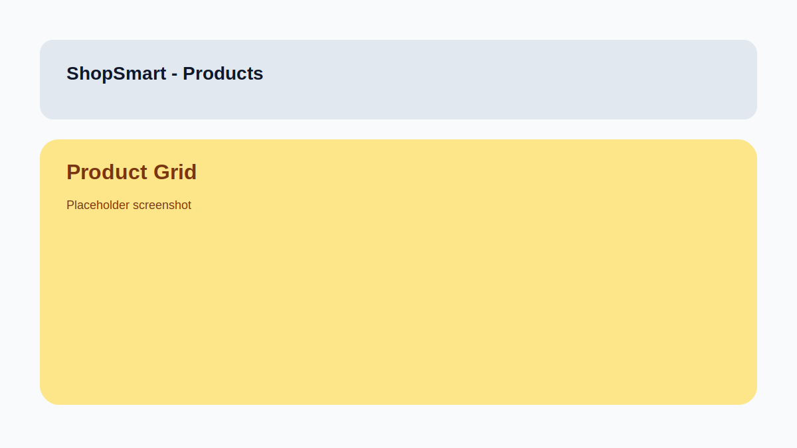
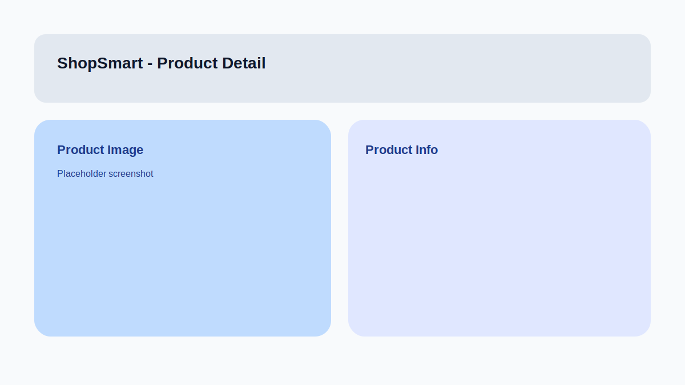

# 🛍️ ShopSmart — AI-Powered E-Commerce Recommendation Engine

> A full-stack personalized product recommendation system combining **Collaborative Filtering**, **Content-Based Filtering**, and a **Hybrid Engine** — built with Flask + React.

---

## 📌 Problem Statement

Design a recommendation engine that suggests relevant products to users based on:
- Browsing history & purchase behaviour  
- User preferences and demographic data  
- Collaborative filtering (users with similar taste)  
- Content-based filtering (product feature similarity)  
- Hybrid technique for maximum accuracy

---

## 🏗️ Architecture

```
┌────────────────────────────────────────────────────────────────┐
│                        FRONTEND (React)                        │
│  Home | Products | Product Detail | Cart | Profile             │
└─────────────────────────┬──────────────────────────────────────┘
                          │  REST API (JSON)
┌─────────────────────────▼──────────────────────────────────────┐
│                    BACKEND (Flask)                              │
│                                                                │
│  ┌─────────────┐  ┌──────────────────────────────────────────┐ │
│  │  Auth/JWT   │  │        Recommendation Engine             │ │
│  │  Products   │  │                                          │ │
│  │  Cart       │  │  ┌────────────┐  ┌───────────────────┐  │ │
│  │  Ratings    │  │  │Collab. CF  │  │ Content-Based CB  │  │ │
│  │  Browsing   │  │  │User-User   │  │ TF-IDF on name,   │  │ │
│  └─────────────┘  │  │Item-Item   │  │ desc, tags, brand │  │ │
│                   │  └─────┬──────┘  └────────┬──────────┘  │ │
│                   │        └──────────┬─────────┘            │ │
│                   │           ┌───────▼──────┐               │ │
│                   │           │ Hybrid Engine │               │ │
│                   │           │ (RRF Fusion)  │               │ │
│                   │           └──────────────┘               │ │
│                   └──────────────────────────────────────────┘ │
│                                                                │
│  ┌──────────────────────────────────────────────────────────┐  │
│  │                  SQLite (SQLAlchemy)                     │  │
│  │  users | products | ratings | browsing_history |        │  │
│  │  purchases | cart                                        │  │
│  └──────────────────────────────────────────────────────────┘  │
└────────────────────────────────────────────────────────────────┘
```

---

## 🧠 Recommendation Algorithms

| Algorithm | How it works | Best when |
|-----------|-------------|-----------|
| **Collaborative Filtering (CF)** | Builds user-item rating matrix, finds similar users via cosine similarity, recommends what they liked | Enough ratings exist |
| **Content-Based Filtering (CB)** | TF-IDF vectorises product text (name + description + tags + brand), builds user profile from browsing history | Cold-start: new users |
| **Hybrid Engine** | Reciprocal Rank Fusion: scores = CF_weight × 1/(rank+1) + CB_weight × 1/(rank+1) | Best overall accuracy |

---

## 📂 Project Structure

```
ecommerce-recommender/
├── backend/
│   ├── app.py                    # Flask app & all REST routes
│   ├── config.py                 # Configuration
│   ├── database.py               # SQLAlchemy models
│   ├── requirements.txt          # Python dependencies
│   ├── models/
│   │   ├── collaborative_filtering.py
│   │   ├── content_based.py
│   │   └── hybrid.py
│   └── data/
│       └── seed_data.py          # Seed products + demo users
│
├── frontend/
│   ├── index.html
│   ├── package.json
│   ├── vite.config.js
│   ├── tailwind.config.js
│   └── src/
│       ├── main.jsx
│       ├── App.jsx
│       ├── index.css
│       ├── services/api.js       # Axios API layer
│       ├── context/AuthContext.jsx
│       ├── components/
│       │   ├── Navbar.jsx
│       │   ├── ProductCard.jsx
│       │   └── RecommendationSection.jsx
│       └── pages/
│           ├── Home.jsx
│           ├── Products.jsx
│           ├── ProductDetail.jsx
│           ├── Login.jsx
│           ├── Register.jsx
│           ├── Cart.jsx
│           └── Profile.jsx
│
├── .gitignore
├── .env.example
└── README.md
```

---

## 🚀 Setup & Run (VS Code)

### Prerequisites
- Python 3.10+
- Node.js 18+
- Git

---

### 1️⃣ Clone the repository

```bash
git clone https://github.com/<your-username>/ecommerce-recommender.git
cd ecommerce-recommender
```

---

### 2️⃣ Backend Setup

```bash
cd backend

# Create virtual environment
python -m venv venv

# Activate (Windows)
venv\Scripts\activate

# Activate (Mac/Linux)
source venv/bin/activate

# Install dependencies
pip install -r requirements.txt

# Seed the database
python data/seed_data.py

# Start the Flask server
python app.py
```

Backend runs at: **http://127.0.0.1:5000**

---

### 3️⃣ Frontend Setup (Dev Mode)

Open a **new terminal** in VS Code:

```bash
cd frontend

# Install Node packages
npm install

# Start Vite dev server
npm run dev
```

Frontend runs at: **http://localhost:5173**

---

## ✅ Quick Start (Single Server)

Build the frontend and let Flask serve it from port 5000:

```bash
cd backend
python -m venv venv
venv\Scripts\activate
pip install -r requirements.txt
python data/seed_data.py

cd ..\frontend
npm install
npm run build

cd ..\backend
python app.py
```

Open: **http://127.0.0.1:5000**

---

## 📸 Screenshots

> Replace the placeholder images in `docs/screenshots/` with your real UI screenshots.





---

### 4️⃣ Demo Login

After seeding, use any of these accounts:

| Username | Email | Password |
|----------|-------|----------|
| alice | alice@demo.com | demo1234 |
| bob | bob@demo.com | demo1234 |
| carol | carol@demo.com | demo1234 |

---

## 🔌 API Endpoints

| Method | Endpoint | Auth | Description |
|--------|----------|------|-------------|
| POST | `/api/auth/register` | ❌ | Register user |
| POST | `/api/auth/login` | ❌ | Login & get JWT |
| GET | `/api/products` | ❌ | List products (filter, paginate) |
| GET | `/api/products/:id` | ❌ | Product detail |
| POST | `/api/browse` | ✅ | Record product view |
| POST | `/api/ratings` | ✅ | Rate a product |
| GET/POST/DELETE | `/api/cart` | ✅ | Cart CRUD |
| POST | `/api/cart/checkout` | ✅ | Place order |
| GET | `/api/recommendations` | ✅ | Personalised recs (`?method=hybrid\|cf\|cb`) |
| GET | `/api/recommendations/similar/:id` | ❌ | Similar products |
| GET | `/api/recommendations/trending` | ❌ | Trending products |

---

## 🛠️ VS Code Extensions (Recommended)

- **Python** — ms-python.python
- **Pylance** — ms-python.vscode-pylance
- **ES7 React Snippets** — dsznajder.es7-react-js-snippets
- **Tailwind CSS IntelliSense** — bradlc.vscode-tailwindcss
- **REST Client** — humao.rest-client (for testing API)

---

## 🔧 Environment Variables

Copy `.env.example` and customise:

```bash
cp .env.example backend/.env
```

---

## 📊 Tech Stack

| Layer | Technology |
|-------|-----------|
| Frontend | React 18, Vite, Tailwind CSS, React Router, Axios |
| Backend | Python 3, Flask, Flask-JWT-Extended, SQLAlchemy |
| Database | SQLite (dev) |
| ML / Rec Engine | scikit-learn (TF-IDF, cosine similarity), pandas, numpy |

---

## 📸 Features

- ✅ User authentication (JWT)
- ✅ Product catalogue with search & category filter
- ✅ Browsing history tracking (auto-recorded)
- ✅ Star ratings with live review
- ✅ Shopping cart & checkout
- ✅ Personalised recommendations (Hybrid / CF / CB)
- ✅ Similar products on detail page
- ✅ Trending & New Arrivals sections
- ✅ Models retrain on new ratings/purchases
- ✅ Product images seeded with curated URLs (see backend/data/seed_data.py)

---

## 🎓 Academic Reference

This project demonstrates:
- **Collaborative Filtering** — Memory-based User-User & Item-Item CF
- **Content-Based Filtering** — TF-IDF vectorization with cosine similarity
- **Hybrid Recommendation** — Reciprocal Rank Fusion (RRF)
- **Cold-start handling** — Trending fallback for new users
- **Real-time model updates** — Models refresh on each rating/purchase

---

## 👨‍💻 Author

Deepan — B.E. Computer Science & Engineering,
AI & ML DEVELOPER

---


